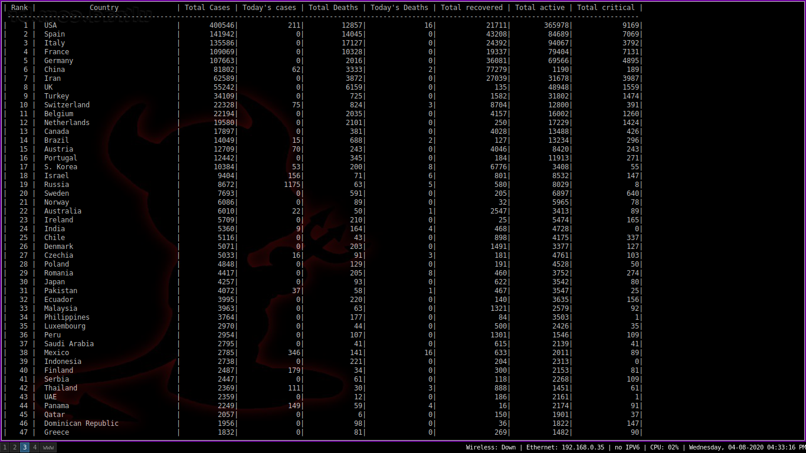
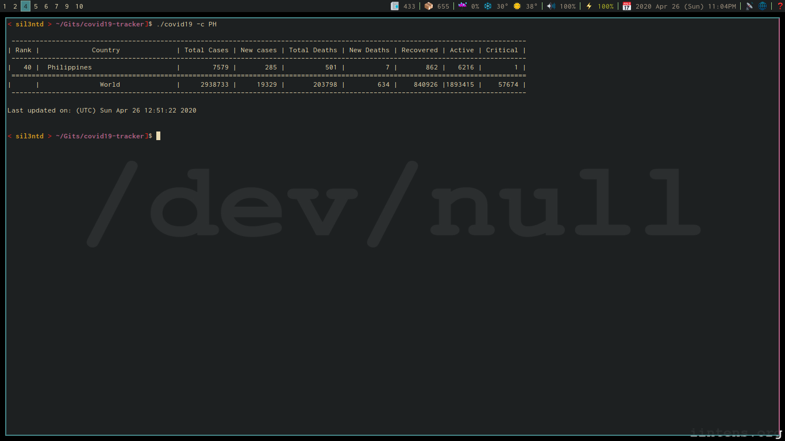

This is a very simple covid19 tracker.    
Displays a table of covid19 cases of a country or of the world.    

## Screenshot

To compile:

	$ c89 covid19.c -o covid19

To view the table for all countries:

	$ ./covid19 -w

To view the table for a specific country:

	$ ./covid19 -c PH 
	$ ./covid19 -c Philippines
	$ ./covid19 -c 608

To view the table for a continent:

	$./covid19 -k Asia

To view a list of country with country codes:

	$ ./covid19 -l

To view help:

	$ ./covid19 -h

The data.json file can be downloaded in json format via:

	$ curl https://corona.lmao.ninja/v2/countries?sort=cases > data.json

	$ curl https://corona.stats.online?format=json > data.json

It is best to download first the data.json file before running the
program to ensure that you have the latest information.

References:

https://github.com/sagarkarira/coronavirus-tracker-cli  
https://github.com/novelcovid/api

**Note:**  
~~As of May 29, 2020 the data structure from both sources has changed which makes
the `-k` option not work properly.~~
